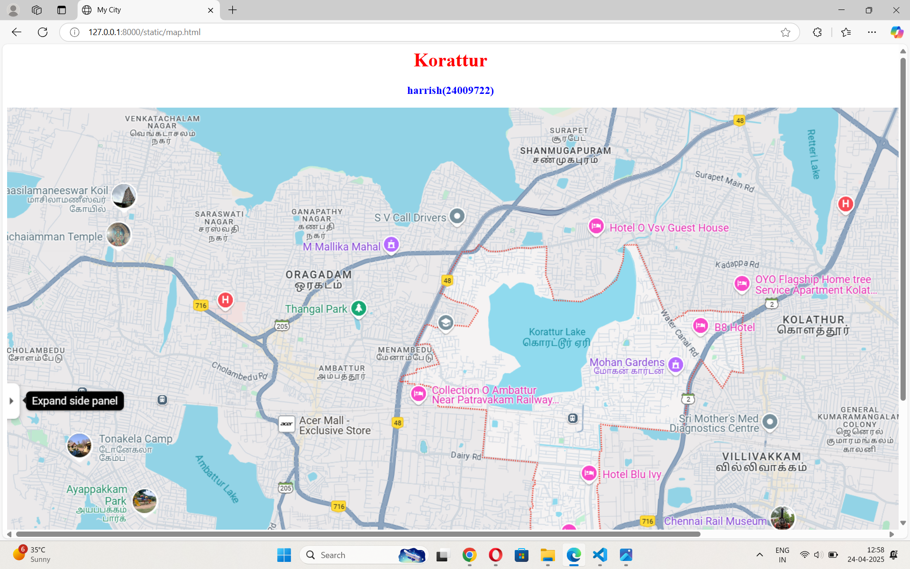
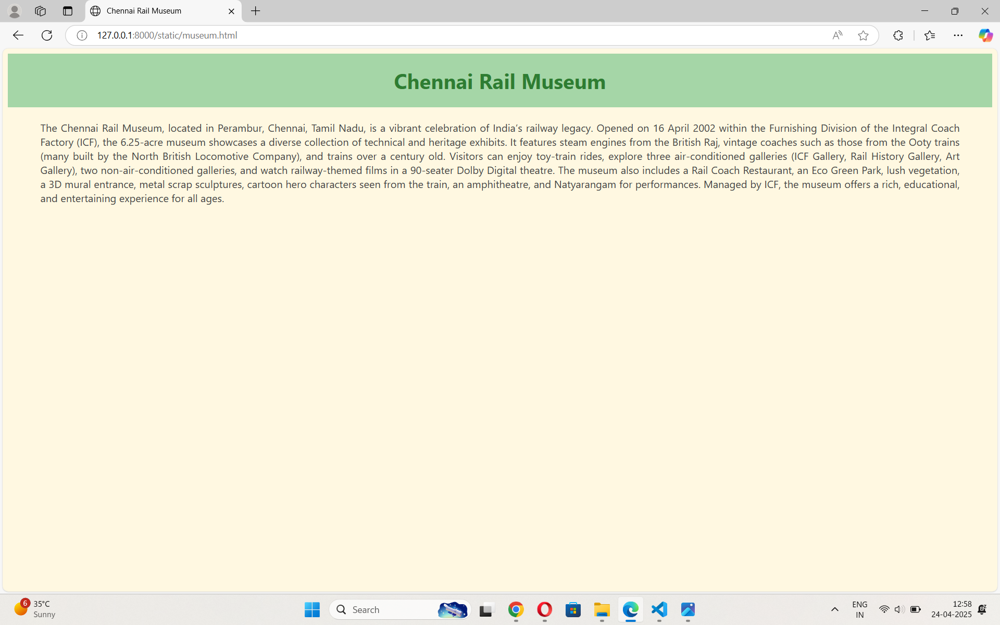
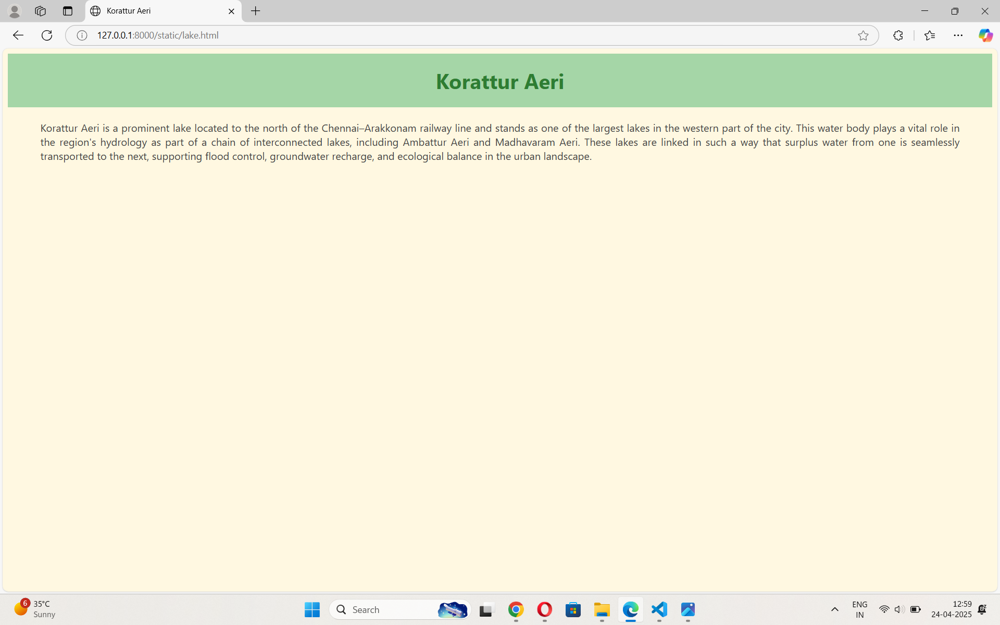
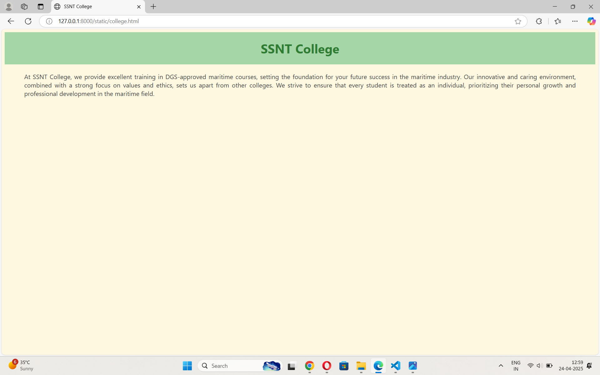
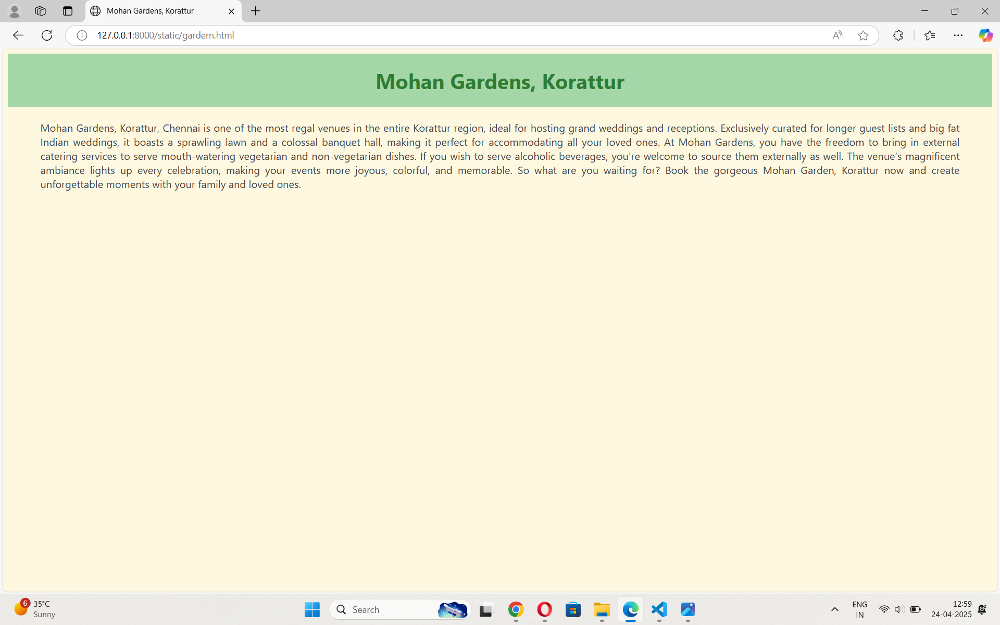

# Ex04 Places Around Me
## Date: 

## AIM
To develop a website to display details about the places around my house.

## DESIGN STEPS

### STEP 1
Create a Django admin interface.

### STEP 2
Download your city map from Google.

### STEP 3
Using ```<map>``` tag name the map.

### STEP 4
Create clickable regions in the image using ```<area>``` tag.

### STEP 5
Write HTML programs for all the regions identified.

### STEP 6
Execute the programs and publish them.

## CODE
```
museum.html
<html lang="en">
<head>
    <meta charset="UTF-8">
    <title>SSNT College</title>
    <style>
        body {
            background-color: #fff8e1;
            font-family: 'Segoe UI', Tahoma, Geneva, Verdana, sans-serif;
            color: #424242;
        }

        h1 {
            text-align: center;
            color: #2e7d32;
            background-color: #a5d6a7;
            padding: 20px;
            margin: 0;
        }

        p {
            text-align: justify;
            margin: 20px 50px;
            font-size: 16px;
        }
    </style>
</head>
<body>

    <h1>SSNT College</h1>

    <p>
        At SSNT College, we provide excellent training in DGS-approved maritime courses, setting the foundation for your future success in the maritime industry. Our innovative and caring environment, combined with a strong focus on values and ethics, sets us apart from other colleges. We strive to ensure that every student is treated as an individual, prioritizing their personal growth and professional development in the maritime field.
    </p>

</body>
</html>


college.html
<html lang="en">
<head>
    <meta charset="UTF-8">
    <title>SSNT College</title>
    <style>
        body {
            background-color: #fff8e1;
            font-family: 'Segoe UI', Tahoma, Geneva, Verdana, sans-serif;
            color: #424242;
        }

        h1 {
            text-align: center;
            color: #2e7d32;
            background-color: #a5d6a7;
            padding: 20px;
            margin: 0;
        }

        p {
            text-align: justify;
            margin: 20px 50px;
            font-size: 16px;
        }
    </style>
</head>
<body>

    <h1>SSNT College</h1>

    <p>
        At SSNT College, we provide excellent training in DGS-approved maritime courses, setting the foundation for your future success in the maritime industry. Our innovative and caring environment, combined with a strong focus on values and ethics, sets us apart from other colleges. We strive to ensure that every student is treated as an individual, prioritizing their personal growth and professional development in the maritime field.
    </p>

</body>
</html>

gardern.html

<html lang="en">
<head>
    <meta charset="UTF-8">
    <title>Mohan Gardens, Korattur</title>
    <style>
        body {
            background-color: #fff8e1;
            font-family: 'Segoe UI', Tahoma, Geneva, Verdana, sans-serif;
            color: #424242;
        }

        h1 {
            text-align: center;
            color: #2e7d32;
            background-color: #a5d6a7;
            padding: 20px;
            margin: 0;
        }

        p {
            text-align: justify;
            margin: 20px 50px;
            font-size: 16px;
        }
    </style>
</head>
<body>

    <h1>Mohan Gardens, Korattur</h1>

    <p>
        Mohan Gardens, Korattur, Chennai is one of the most regal venues in the entire Korattur region, ideal for hosting grand weddings and receptions. Exclusively curated for longer guest lists and big fat Indian weddings, it boasts a sprawling lawn and a colossal banquet hall, making it perfect for accommodating all your loved ones. At Mohan Gardens, you have the freedom to bring in external catering services to serve mouth-watering vegetarian and non-vegetarian dishes. If you wish to serve alcoholic beverages, you're welcome to source them externally as well. The venue’s magnificent ambiance lights up every celebration, making your events more joyous, colorful, and memorable. So what are you waiting for? Book the gorgeous Mohan Garden, Korattur now and create unforgettable moments with your family and loved ones.
    </p>

</body>
</html>

lake.html

<html lang="en">
<head>
    <meta charset="UTF-8">
    <title>Korattur Aeri</title>
    <style>
        body {
            background-color: #fff8e1;
            font-family: 'Segoe UI', Tahoma, Geneva, Verdana, sans-serif;
            color: #424242;
        }

        h1 {
            text-align: center;
            color: #2e7d32;
            background-color: #a5d6a7;
            padding: 20px;
            margin: 0;
        }

        p {
            text-align: justify;
            margin: 20px 50px;
            font-size: 16px;
        }
    </style>
</head>
<body>

    <h1>Korattur Aeri</h1>

    <p>
        Korattur Aeri is a prominent lake located to the north of the Chennai–Arakkonam railway line and stands as one of the largest lakes in the western part of the city. This water body plays a vital role in the region's hydrology as part of a chain of interconnected lakes, including Ambattur Aeri and Madhavaram Aeri. These lakes are linked in such a way that surplus water from one is seamlessly transported to the next, supporting flood control, groundwater recharge, and ecological balance in the urban landscape.
    </p>

</body>
</html>


```

## OUTPUT








## RESULT
The program for implementing image maps using HTML is executed successfully.
